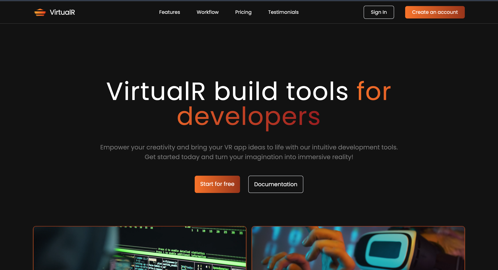

# Virtual-R

[](https://virtualr-landing.vercel.app/)

**VirtualR** is a landing page showcasing development tools designed to empower developers in creating immersive VR applications. Turn your ideas into reality with our intuitive tools and start building your VR experiences today!

## Features

- **Intuitive Development Tools**: Easy-to-use tools to streamline VR app creation.
- **Empowering Creativity**: Bring your VR ideas to life with advanced features.
- **Immersive Reality**: Create captivating and engaging VR experiences effortlessly.

## Getting Started

### Installation

1. **Clone the repository:**

   ```bash
   git clone https://github.com/your-username/virtual-r.git
   cd virtual-r
   ```

2. **Install the dependencies:**

   ```bash
   npm install
   ```

3. **Run the development server:**
   ```bash
   npm run dev
   ```
   Open [http://localhost:3000](http://localhost:3000) to view it in the browser. The app will automatically reload if you make edits.

### Contributing

- Fork the repository
- Create a branch
  ```bash
  git checkout -b fix/amazingFix
  ```
- Commit your changes and push to your branch
  ```bash
  git commit -m "made an amazingFix"
  git push origin fix/amazingFix
  ```
- Open a pull request

## License

Distributed under the MIT License. See `LICENSE` for more information.
